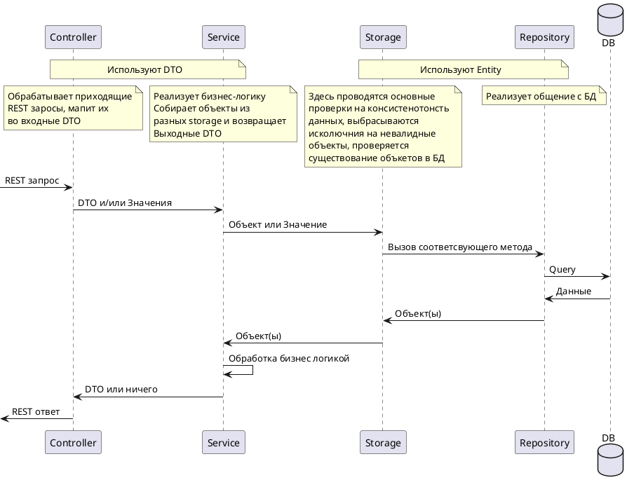

# Слои приложения 

```plantuml
@startuml

participant Controller
participant Service
participant Storage
participant Repository
database DB

note over Controller, Service
Используют DTO
end note 
/ note over Storage, Repository
Используют Entity
end note
note over Controller 
Обрабатывает приходящие
REST заросы, мапит их 
во входные DTO
end note
/ note over Service
Реализует бизнес-логику
Собирает объекты из 
разных storage и возвращает
Выходные DTO
end note
/ note over Storage
Здесь проводятся основные
проверки на консистенотонсть 
данных, выбрасываются 
исколючния на невалидные 
объекты, проверяется 
существование объкетов в БД
end note
/ note over Repository
Реализует общение с БД
end note

-> Controller : REST запрос
Controller -> Service : DTO и/или Значения

Service -> Storage : Объект или Значение
Storage -> Repository : Вызов соответсвующего метода
Repository -> DB : Query
DB -> Repository : Данные
Repository -> Storage : Объект(ы)

Storage -> Service : Объект(ы)
Service -> Service : Обработка бизнес логикой
Service -> Controller : DTO или ничего

<- Controller : REST ответ

@enduml
```